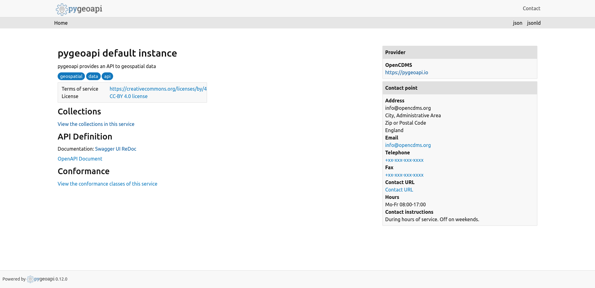
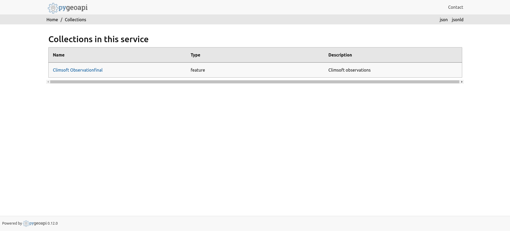
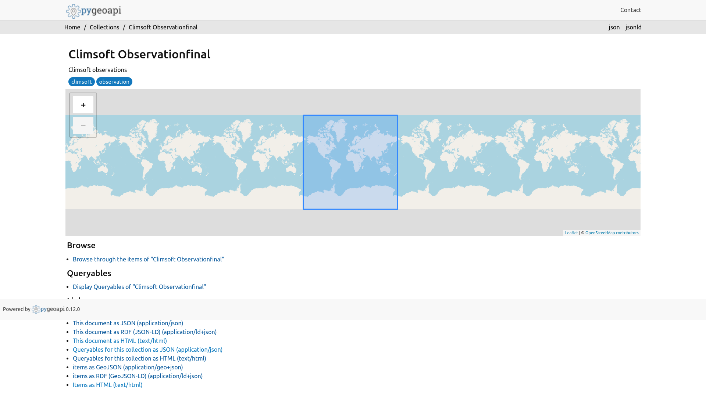
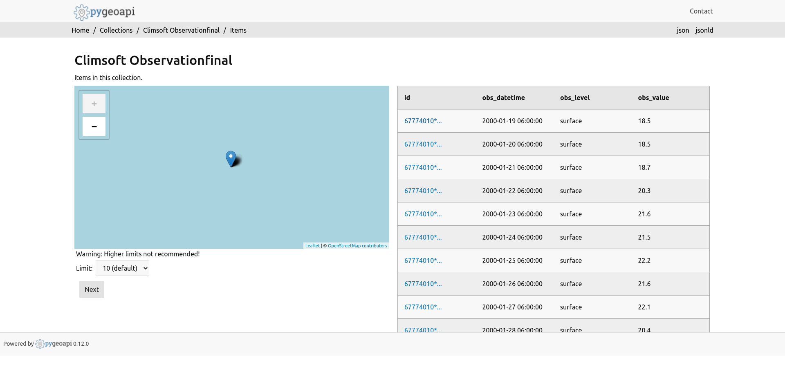
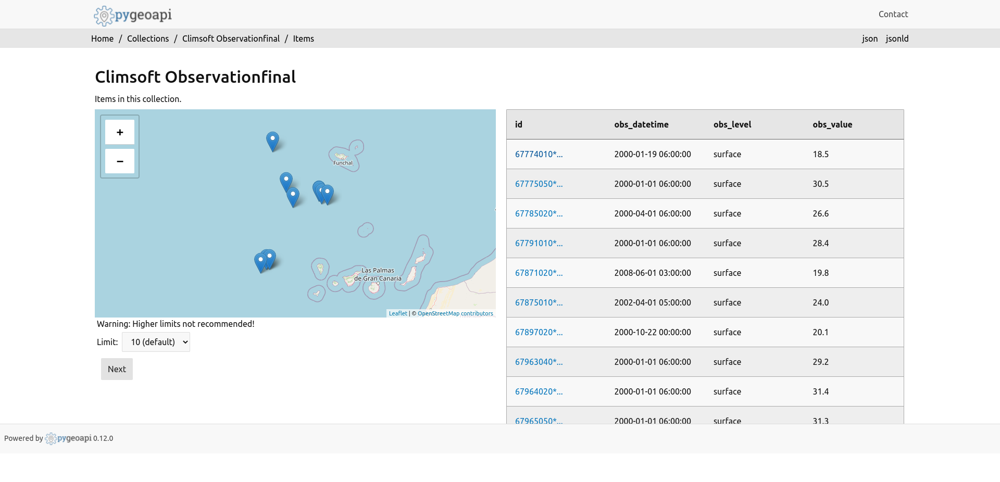
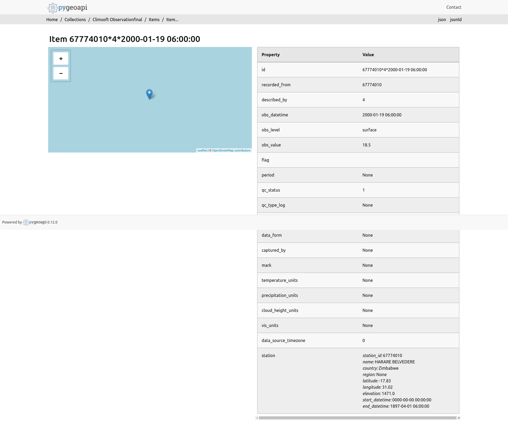

`opencdms.pygeoapi.climsoft_provider.ClimsoftProvider` can visualize `observationfinal`
data from `Climsoft` CDMS.

Here are some screenshots

Homepage

Collections

Climsoft Collection

Climsoft Collection Items

As there are a lot of data for climsoft collection, I took a screenshot using
a `group by recordedFrom` query, so that we can check if all the stations are visible
if the data are from multiple stations

Climsoft collection, single item

