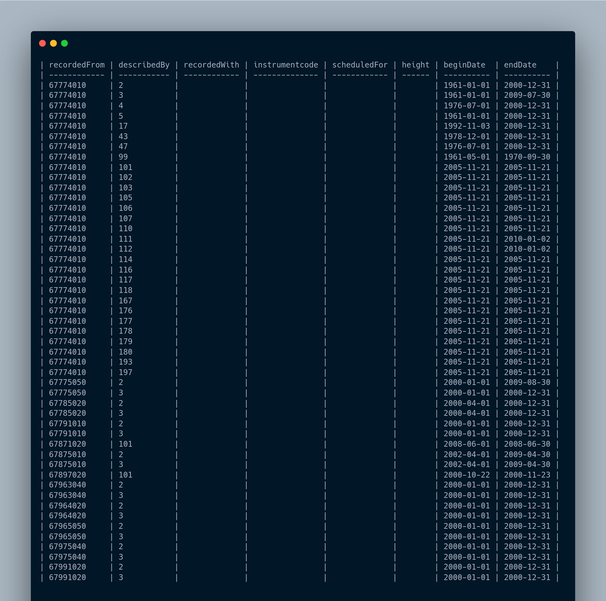

# How to use these utility functions for Climsoft

Create session and import dependencies

```python
from opencdms.utils.db import get_connection_string
from sqlalchemy.engine import create_engine
from sqlalchemy.orm.session import sessionmaker

from opencdms.utils.climsoft.stationelement import (
    sync_stationelement_with_observationfinal_sql,
    sync_stationelement_with_observationfinal_sqla,
    auto_update_end_date
)

DB_URL = get_connection_string(
    "mysql",
    "mysqldb",
    "root",
    "password",
    "127.0.0.1",
    "23306",
    "mariadb_climsoft_test_db_v4"
)
db_engine = create_engine(DB_URL)
SessionLocal = sessionmaker(bind=db_engine)
session = SessionLocal()
```

To sync stationelement table with observationfinal table. (this function truncates the stationelement table and then repopulates using raw sql)

```python
sync_stationelement_with_observationfinal_sql(session)
session.close()
```

To sync stationelement table with observationfinal table. (this function only updates/deletes new/invalid rows)

```python
sync_stationelement_with_observationfinal_sqla(session)
session.close()
```

To update endDate column if there is considerable delay in last updated data and current date. here we used 60 days as considerable delay
```python
auto_update_end_date(session, datetime.timedelta(days=60))
session.close()
```

After running the above code, the `stationelement` table should look like this
(if we used this database `mariadb_climsoft_test_db_v4` from `opencdms-test-data`)


